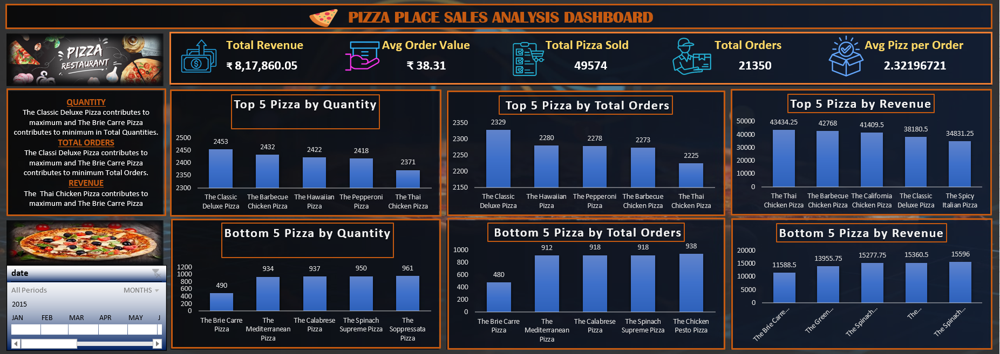

🍕 Pizza Place Sales Analysis Dashboard

📌 Project Overview:

This project features a visually interactive Pizza Sales Analysis Dashboard built using Microsoft Excel. It provides valuable insights into overall sales, top-selling pizzas, customer behaviour, and sales trends, helping the pizza business make informed decisions to improve its performance.

🎯 Objective:

The main goal of this project is to analyze pizza sales data to understand how the business is performing. Specifically, it helps:
1.  Track total revenue, orders, and pizzas sold
2.	Identify the most popular pizza categories and sizes
3.	Discover the busiest times of the day for orders
4.	Spot best and worst performing pizzas
5.	Understand customer ordering habits like average order size and value
These insights can be used to improve menu planning, marketing strategies, staffing during peak hours, and overall business efficiency.

📥 Datasets:

This project uses four datasets for pizza sales analysis:
- [Order Details](order_details.csv)
- [Orders](orders.csv)
- [Pizza Types](pizza_types.csv)
- [Pizzas](pizzas.csv)

❓ Business Questions Answered:

1.	How much revenue is the pizza place making?
2.	What’s the total number of pizzas sold and how many orders are placed?
3.	What’s the average value of each order and how many pizzas does a customer usually order?
4.	Which hours of the day are the busiest?
5.	Which pizza category (Classic, Supreme, etc.) and size (S, M, L, etc.) sells the most?
6.	Which pizzas are the top sellers and which ones are not performing well?
7.	How many customers are visiting daily on average?

🛠️ Tools and Techniques Used:

•	Tool: Microsoft Excel

•	Techniques Used:
	  -Pivot Tables and Pivot Charts
	  -Slicers (for month and date filtering)
	  -Pie Charts, Line Charts, Bar Charts
	  -Calculated Fields for KPIs like Avg Order Value and Avg Pizzas per Order
	  -Clean formatting and layout for a user-friendly dashboard

🔄 Process Followed:

1.	Data Preparation: Cleaned the raw pizza sales data to remove duplicates and format columns properly.
2.	Metric Calculation: Created key metrics like Total Revenue, Total Orders, Avg Order Value, etc.
3.	Visualization: Built two Excel dashboards:
-	Overview Dashboard for high-level insights
-	Detailed Dashboard to analyze individual pizza performance
4.	Added Filters: Included slicers to filter data by month.

📊 Dashboard Previews:

Dashboard 1:

Dashboard 2:

📥 Download Dashboard File:

[Excel Dashboard File](pizza place analysis dashboard.xlsx)

📊 Dashboard Insights:

🔹 Overall Performance:
        •     Total Revenue: 
	            ₹8,17,860.05
        •	    Total Pizzas Sold: 
	                     49,574
        •	    Total Orders:  
	                      21,350
        •	    Average Order Value: 
	                          ₹38.31
        •           Average Pizzas per Order: 
	                              2.32
      
🔹 Customer Behaviour:
        •	    Orders peak during 12 PM–1 PM and 4 PM–7 PM
        •	    The pizza place gets a consistent number of daily customers throughout the period
      
🔹 Pizza Category & Size:
        •	    Top Category: Classic (14,579 pizzas sold)
        •	    Top Size: Large (L) – accounts for 45.89% of total sales
      
🔹 Top Performing Pizzas:
      •	    By Quantity Sold:
	  -    The Classic Deluxe Pizza
	  -    The Barbecue Chicken Pizza
	  -    The Hawaiian Pizza
	  -    The Pepperoni Pizza
	  -    The Thai Chicken Pizza
      •	    By Revenue Generated:
	  -    The Thai Chicken Pizza (₹43,843.25)
	  -    The Barbecue Chicken Pizza
	  -    The California Chicken Pizza
	  -    The Classic Deluxe Pizza
	  -    The Spicy Italian Pizza
 
🔹 Low Performing Pizzas:
      •	    Least Sold:
	  -    The Brie Carre Pizza
	  -    The Spinach Supreme Pizza
          -    The Calabrese Pizza
	  -    The Chicken Pesto Pizza

✅ Conclusion:

This Excel dashboard effectively transforms pizza sales data into easy-to-understand visuals and insights. It helps the business:
      1.	    Focus on top-selling pizzas and high-performing categories
      2.              Improve marketing and promotions for underperforming items
      3.                Plan inventory based on demand for certain sizes
      4.	          Allocate staff efficiently during peak hours
By using Excel’s powerful features, this project shows how even simple tools can deliver meaningful business intelligence.

